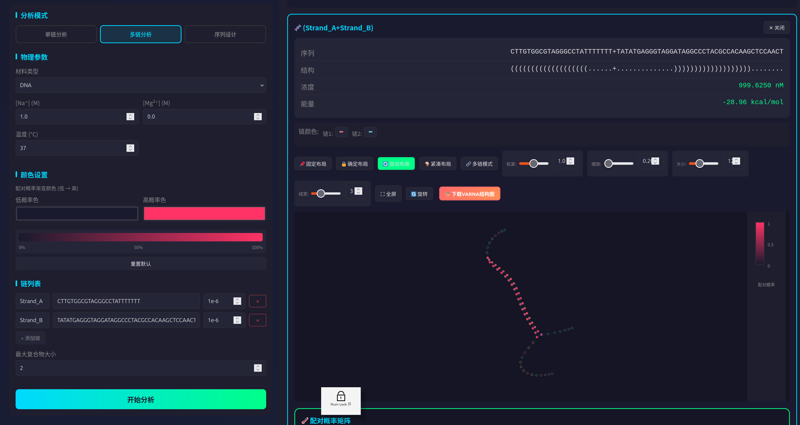

# NUPACK Web v1.3.0 - Nucleic Acid Structure Visualization Tool

> 📝 **Note**: This document is AI-generated. If you are a first-time user, we strongly recommend reading this detailed illustrated tutorial:
> 
> 🔗 **[Zhihu Column: NUPACK Web Tutorial for Beginners](https://zhuanlan.zhihu.com/p/2018702350303380650)** (Chinese)

A localized web interface for nucleic acid analysis based on Flask + NUPACK, providing an intuitive visualization experience.



**[中文文档 / Chinese Documentation](README.md)**

## 🆕 v1.4.0 New Features

### 🎨 VARNA Structure Export (Major Update)
**Description**: Integration of VARNA engine for publication-quality RNA/DNA secondary structure visualization.

**Features**:
- ✅ High-quality vector graphics (SVG format)
- ✅ Pairing probability gradient coloring
- ✅ Multi-chain structure support (automatic separation display)
- ✅ Citation prompt (for paper publication)

**Usage**:
1. Run structure analysis (single or multi-chain)
2. Click the orange-red **"🎨 Download VARNA Structure"** button
3. SVG file is automatically downloaded, ready for publication


**Citation**:
> VARNA: Interactive drawing and editing of the RNA secondary structure  
> Kévin Darty, Alain Denise and Yann Ponty  
> Bioinformatics, pp. 1974-1975, Vol. 25, no. 15, 2009

### 📦 Other Updates
- 🖥️ **Desktop Launcher** - Double-click desktop icon to start
- 🔄 **Auto Browser Launch** - Automatically opens control panel on startup
- ☕ **Java Auto-Install** - Automatically detects and installs OpenJDK 11
- 📐 **Layout Optimization** - Panel ratio changed to 1:2, wider input box
- 🔧 **Multi-Chain VARNA Fix** - Correct handling of multi-chain structure separators

---

## 🆕 v1.3.0 New Features

### 🔄 Auto Layout (Major Update)
**Algorithm**: Nucleotides are initially distributed uniformly on a circle in sequence order. Through D3.js force-directed simulation, hydrogen bond attraction forces nucleotides to contract to their actual pairing positions. Combined with covalent bond constraints and inter-node repulsion, this achieves automated aesthetic layout.

> 💡 **Tip**: Drag the tension slider to make the structure more regular!

### Other Feature Updates
- 📦 **Compact Layout** (Unstable) - All hydrogen bonds and covalent bonds have equal length, presenting a regular grid pattern
- 🔒 **Lock Layout** (Unstable) - Prevents nucleotide dragging when locked
- 🔃 **Rotate** (Unstable) - Supports 90° rotation of the structure
- 🎨 **Multi-Chain Mode** - Different chains use different colors with customization support
- 🔍 **Improved Zoom** - Unlimited zoom, numeric input without restrictions
- 📏 **Nucleotide Size** - Customizable nucleotide circle size, numeric input without restrictions
- 🖊️ **Line Width** - Customizable bond line width, numeric input without restrictions
- 💾 **Download Project** - One-click ZIP download of the project
- ☕ **Donate** - Support the developer
- 📝 **Version Display** - Version number shown in title bar
- ⚠️ **Warning Banner** - Reminder that the project is still under development

## ✨ Features

### 🔬 Single-Strand Analysis
- Calculate Minimum Free Energy (MFE) structure
- Pairing probability matrix visualization
- **Suboptimal Structure Analysis** - Explore multiple possible structures near MFE energy
- Force-directed graph visualization of secondary structure
- Customizable pairing probability gradient colors

### 🧬 Multi-Strand Analysis
- Test tube analysis with multiple strands
- Complex concentration distribution pie chart
- Interactive structure preview and detailed view

### 🎨 Sequence Design
- Domain definition
- Target complex design
- Multiple design attempts with automatic selection of optimal results

### 📦 Other Features
- Chinese/English interface switching
- Dark/Light theme
- Export PNG images, JSON data, CSV matrix
- Jupyter Lab integration
- Project download (ZIP)
- Responsive design

## 📋 System Requirements

- Python 3.8+
- NUPACK 4.0+ (requires valid license)

## 🚀 Quick Installation

> ⚠️ **Warning**: The following quick installation method installs packages directly to the system Python environment, which **may affect your existing Python environment**.
> 
> If you are an experienced developer or have other Python projects on your system, **we strongly recommend using virtual environment installation** (see "Professional Installation" below).

### 1. Install NUPACK

First, register and obtain a license from the NUPACK website: https://www.nupack.org/

```bash
# Install NUPACK
pip install nupack --break-system-packages

# Activate license (replace with your license key)
nupack-license --user "your_email@example.com" --key "your_license_key"
```

### 2. Install NUPACK Web

```bash
# Clone repository
git clone https://github.com/Luminave/nupack-webapp.git

# Enter directory
cd nupack-webapp

# Run installation script
./install.sh
```

### 3. Start Application

```bash
./start.sh
```

Then open in browser: http://127.0.0.1:5000

---

### One-Line Installation (Copy & Paste)

```bash
git clone https://github.com/Luminave/nupack-webapp.git && cd nupack-webapp && ./install.sh && ./start.sh
```

---

## 🔬 Professional Installation (Using Virtual Environment)

If you are an experienced developer, we recommend using a Python virtual environment to avoid affecting the system environment:

```bash
# Clone repository
git clone https://github.com/Luminave/nupack-webapp.git
cd nupack-webapp

# Create virtual environment
python3 -m venv venv
source venv/bin/activate

# Install NUPACK (first time)
pip install nupack
nupack-license --user "your_email@example.com" --key "your_license_key"

# Install dependencies
pip install -r requirements.txt

# Start
python3 app.py
```

---

## 📖 Usage Examples

### Single-Strand Analysis Example
```
Sequence: GCGCAAAAGCGC
```
This sequence can form a hairpin structure, useful for testing suboptimal structure analysis.

### Multi-Strand Analysis Example
```
Strand A: GCGCAAAAGCGC
Strand B: GCGCTTTTGCGC
Concentration: 1e-6 M each
```
Two complementary strands will form a duplex complex.

### Sequence Design Example
```
Domain: a = N10
Target strands: S1 = a, S2 = ~a
Target complex: S1,S2 with structure ..........+..........
```
Design two complementary 10nt strands.

## 🔧 Configuration

The application runs on `127.0.0.1:5000` by default. To modify:

```python
# In app.py, modify the last line
app.run(host='0.0.0.0', port=8080, debug=False)
```

## 📁 Project Structure

```
nupack-webapp/
├── app.py              # Flask main application
├── requirements.txt    # Python dependencies
├── install.sh          # Installation script
├── start.sh            # Start script
├── README.md           # Documentation (Chinese)
├── README_EN.md        # Documentation (English)
├── LICENSE             # License
└── templates/
    └── index.html      # Main page template
```

## ❓ FAQ

**Q: `ModuleNotFoundError: No module named 'nupack'`**
> A: NUPACK is not installed or license is not activated. Please complete NUPACK installation first.

**Q: `ModuleNotFoundError: No module named 'flask'`**
> A: Run `pip install flask` or re-run `./install.sh`

**Q: Port 5000 is occupied**
> A: Modify `port=5000` in the last line of `app.py` to another port

**Q: Installation script has no execute permission**
> A: Run `chmod +x install.sh start.sh` to add execute permission

## 🙏 Acknowledgments

- [NUPACK](https://www.nupack.org/) - Nucleic acid structure prediction software
- [D3.js](https://d3js.org/) - Data visualization library
- [Flask](https://flask.palletsprojects.com/) - Web framework

## 📄 License

This project is for learning and research purposes only. Use of NUPACK functionality requires compliance with the NUPACK license agreement.

---

**Author**: Victor.Guo  
**GitHub**: https://github.com/Luminave/nupack-webapp
ttps://d3js.org/) - Data visualization library
- [Flask](https://flask.palletsprojects.com/) - Web framework

## 📄 License

This project is for learning and research purposes only. Use of NUPACK functionality requires compliance with the NUPACK license agreement.

---

**Author**: Victor.Guo  
**GitHub**: https://github.com/Luminave/nupack-webapp
