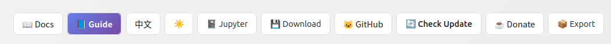
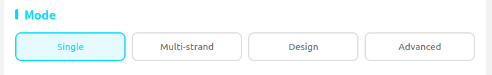
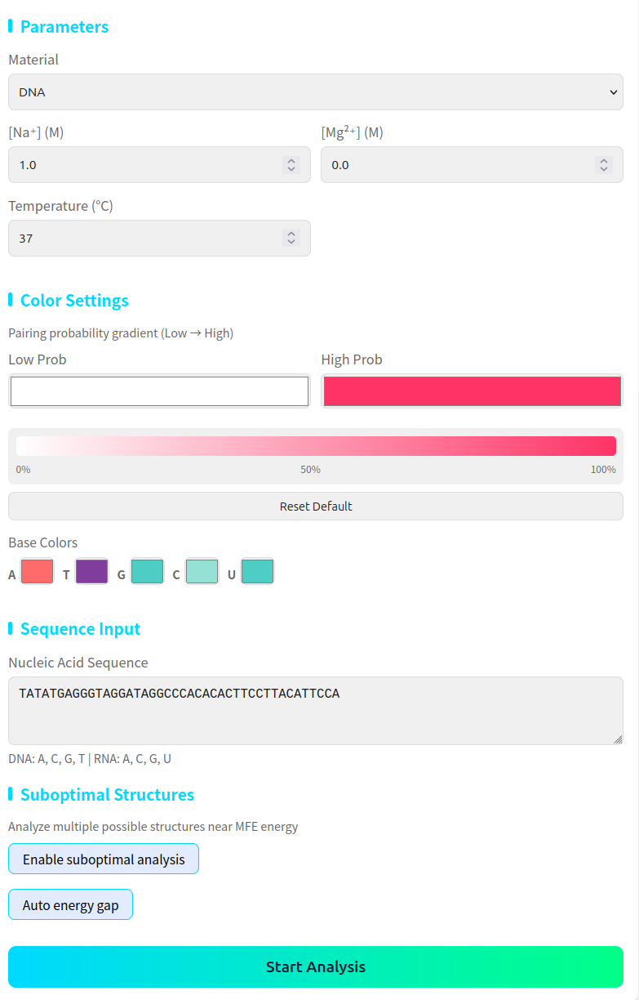
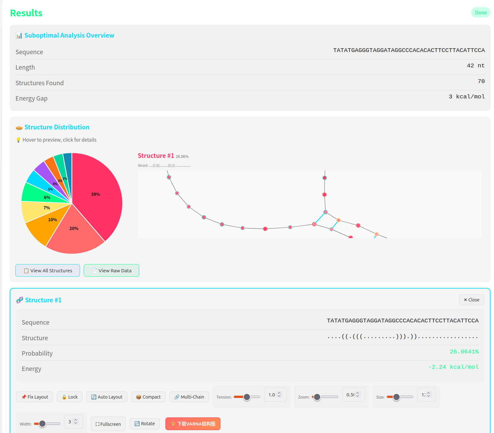
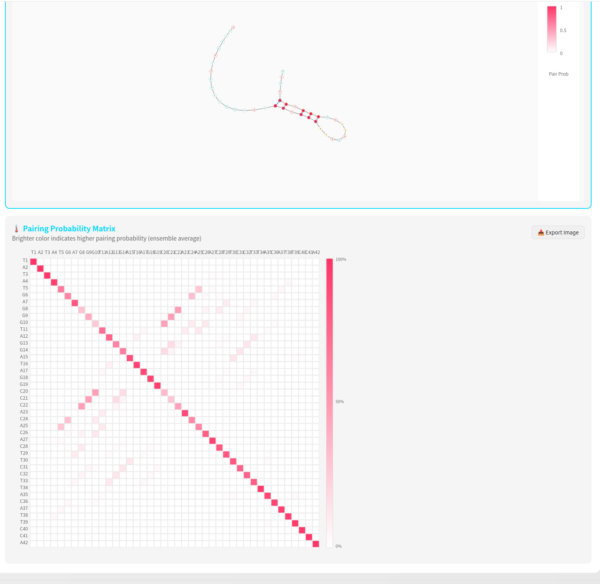
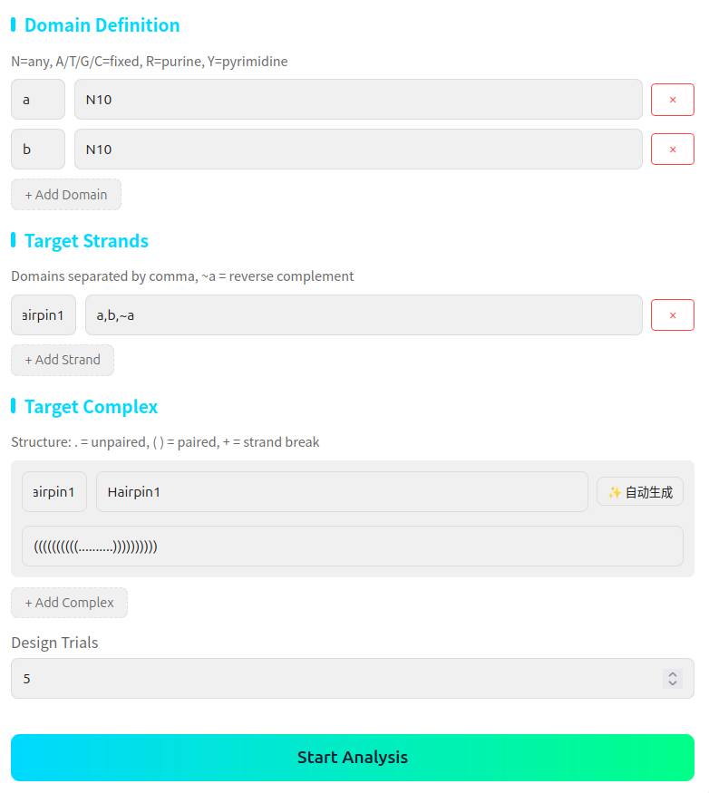

# NUPACK Web App Tutorial / NUPACK Web App 使用教程

> 📖 A local visual tool for nucleic acid structure analysis powered by NUPACK
> 📖 基于 NUPACK 的本地核酸结构分析可视化工具

---

## Getting Started / 使用方法

### Interface Overview / 界面介绍

The top navigation bar contains the following buttons:

顶部导航栏包含以下按钮：

- **Docs**: View the official NUPACK documentation / 查看 NUPACK 官方文档
- **Guide**: This user guide for the web app / 本 webapp 的使用指南
- **☀️/🌙**: Toggle between light and dark themes (light theme is default) / 切换深色/浅色主题（默认浅色）
- **Jupyter**: Open a Jupyter notebook interface for programmatic NUPACK usage. Requires Jupyter to be installed in your environment. / 打开 Jupyter notebook 界面用于编程式调用 NUPACK。需要已在环境中安装 Jupyter。
- **Download**: Download the current project data. This feature is experimental and may have issues. / 下载当前项目数据。此功能为实验性功能，可能存在问题。
- **GitHub**: View the project source code on GitHub / 查看项目在 GitHub 上的源代码
- **Check Update**: Check if a newer version is available / 检查是否有新版本可用
- **Donate**: Support the developer ☕ / 支持开发者 ☕
- **Export**: Export analysis data and results. This feature is experimental. / 导出分析数据和结果。此功能为实验性功能。

There are four analysis modes / 有四种分析模式：

- **Single**: Single-strand analysis / 单链分析
- **Multi-strand**: Multi-strand analysis / 多链分析
- **Design**: Sequence design / 序列设计
- **Advanced**: Advanced visualization mode / 高级模式

---

### Single-Strand Analysis / 单链分析

Calculate the structure and thermodynamic properties of a single nucleic acid strand under specified conditions.

计算一条核酸链在指定条件下的结构和热力学性质。

**Input parameters / 输入参数:**

- **Conditions**: Ionic environment (Na⁺, Mg²⁺), nucleic acid type (DNA/RNA), temperature / 离子环境（Na⁺、Mg²⁺）、核酸类型（DNA/RNA）、温度
- **Sequence**: Enter your nucleic acid sequence / 输入核酸序列
- **Color Settings**: Customize the pairing probability gradient colors and base colors. Note: These color settings only apply to the in-app structure visualization, not to exported VARNA images. / 自定义配对概率渐变颜色和碱基颜色。注意：这些颜色设置仅应用于 webapp 内的结构可视化，不适用于导出的 VARNA 图片。
- **Suboptimal Structure Analysis**: When enabled, displays all possible structures near the MFE and calculates detailed parameters for each. The "Auto energy gap" option is recommended — manual entry may cause NUPACK to compute too many structures and crash. / 启用后，展示 MFE 附近所有可能的结构，并计算每种结构的详细参数。推荐使用"自动能量窗口"选项——手动输入可能导致 NUPACK 计算过多结构而报错。

**Results / 结果展示:**

After clicking "Start Analysis", you'll see:

点击"开始分析"后，将看到：

- **Structure Distribution (Pie Chart)**: Shows the relative population of each predicted structure. Click on a slice to view that structure in detail. If a structure has very low probability and is hard to see in the pie chart, use "View All Structures" to see the complete list. / 展示每种预测结构的相对含量。点击饼图的某一部分可查看该结构的详细信息。如果某结构概率太低难以在饼图中显示，可使用"查看所有结构"查看完整列表。

- **Structure Visualization Controls / 结构可视化控件:**
  - **Fix Layout / 固定布局**: Arrange all bases on a circle. If you accidentally clicked this and locked the structure, press "Auto Layout" to undo. / 将所有碱基排列在圆上。如果误点击导致结构被锁定，按"自动布局"恢复。
  - **Lock / 确定布局**: Prevent further dragging of nucleotides / 锁定后不允许拖拽核苷酸
  - **Auto Layout / 自动布局**: Re-arrange the structure using the force-directed algorithm. Great for complex structures! / 使用力导向算法重新排列结构。复杂结构的克星！
  - **Compact / 紧凑布局**: This feature is not yet implemented / 此功能暂未实现
  - **Multi-Chain / 多链模式**: Color bases by their chain membership, useful for multi-strand structures / 按链分配碱基颜色，适用于多链结构
  - **Tension / Zoom / Size / Width**: Adjust the visualization parameters. You can manually enter values beyond the slider range. / 调整可视化参数。可手动输入超过滑动条范围的数值。
  - **Fullscreen / 全屏**: View the structure in fullscreen mode / 全屏查看结构
  - **Rotate / 旋转**: Rotate the structure (currently experimental) / 旋转结构（目前为实验性功能）
  - **Export VARNA / 导出VARNA结构图**: Render the structure using VARNA for publication-quality figures / 使用 VARNA 渲染结构图，适合论文发表或正式汇报

- **Pairing Probability Matrix / 配对概率矩阵**: Displays the probability of each base pairing with every other base. Hover over a cell to see details. The color configuration can be modified in single-strand analysis mode. You can export this image using the "Export Image" button. / 展示每个碱基与其他所有碱基的配对概率。悬浮在色块上可查看详情。颜色配置可在单链分析模式中修改。可使用"导出图片"按钮导出。

---

### Multi-Strand Analysis / 多链分析

Calculate what complexes form when multiple strands are mixed in solution.

计算多条链在溶液中会形成什么复合物。

**Important**: Pay attention to the "Max Complex Size" parameter. If you expect a complex of 5 strands but set the max size to 3, the desired complex will not be found.

**重要提示**：注意"最大复合物大小"参数。如果预期形成5条链的复合物，但最大大小设为3，则无法得到目标复合物。

Other features are similar to single-strand analysis.

其他功能与单链分析类似。

---

### Sequence Design / 序列设计

Design nucleic acid sequences that fold into desired structures.

设计能折叠成目标结构的核酸序列。

**Example: Designing a Hairpin / 示例：设计发卡结构**

Suppose you want to design a hairpin with a stem domain **a** and a loop domain **b**, each 10 nucleotides long.

假设要设计一个茎结构域 **a** 和环结构域 **b** 均为 10 个碱基的发卡。

**Step 1: Define Domains / 第一步：定义结构域**

Enter `N10` for both domains (10 random nucleotides). Other input options include:

两个结构域都输入 `N10`（10个任意碱基）。其他输入方式包括：

- `A`, `T`, `G`, `C` = Fixed base / 固定碱基
- `R` = Purine (A or G) / 嘌呤
- `Y` = Pyrimidine (C or T/U) / 嘧啶
- `N` = Any base / 任意碱基

For more notation options, refer to the [NUPACK official documentation](https://docs.nupack.org/).

更多符号说明请参考 [NUPACK 官方文档](https://docs.nupack.org/)。

**Step 2: Define Target Strand / 第二步：定义目标链**

Describe the strand sequence. For a single hairpin named "Hairpin1", the sequence from 5' to 3' is: `a, b, ~a` (domain a, domain b, reverse complement of a).

描述链的序列。对于名为 "Hairpin1" 的单条发卡链，从 5' 到 3' 的序列为：`a, b, ~a`（结构域 a、结构域 b、a 的反向互补）。

**Step 3: Define Target Complex / 第三步：定义目标复合物**

Specify the secondary structure using dot-bracket notation:
- `(` and `)` = paired bases / 配对碱基
- `.` = unpaired bases / 未配对碱基
- `+` = chain separator (for multi-strand complexes) / 链分隔符（多链复合物）

For the hairpin: `(((((((((..........)))))))))`

**Step 4: Design / 第四步：设计**

Click "Start Analysis" to generate candidate sequences. The auto-generation feature works well for simple structures but may fail for complex ones.

点击"开始分析"生成候选序列。自动生成功能在结构简单时可靠，复杂结构可能出错。

For multi-strand complexes, define each strand's domains and structures using the same approach.

多链复合物的设计方法相同：定义每条链的结构域和目标结构。

---

### Advanced Mode / 高级模式

The Advanced mode allows you to directly visualize a nucleic acid structure by entering its sequence and dot-bracket notation — no NUPACK computation required.

高级模式允许你直接输入序列和 dot-bracket 结构表达式来可视化核酸结构，无需 NUPACK 计算。

**Input / 输入:**

- **Sequence**: The nucleic acid sequence (e.g., `GCGUACGAUCGAUCGAUCGAUCGUACGC`) / 核酸序列
- **Structure**: The dot-bracket structure expression (e.g., `(((((...((((...)))).)))))`) / dot-bracket 结构表达式
- **Pairs Probability Matrix (Optional)**: Paste a N×N matrix or `i j probability` format data from NUPACK output. If provided, bases will be colored by pairing probability instead of base type. / 配对概率矩阵（可选）：粘贴 NUPACK 输出的 N×N 矩阵或 `i j 概率` 格式数据。提供后碱基将按配对概率着色而非碱基类型。
- **Recalculate Pairs Matrix**: Check this to have NUPACK compute the pairing probability matrix using the temperature and ionic conditions from the parameter panel. / 勾选此项让 NUPACK 根据参数面板中的温度和离子条件计算配对概率矩阵。

**Visualization / 可视化:**

- Bases are colored by their type (A/T/G/C/U) by default. When a pairing probability matrix is provided, bases are colored by pairing probability (white → red gradient). / 默认按碱基类型着色。提供配对概率矩阵后，按配对概率着色（白→红渐变）。
- The **Export VARNA** button is always available. With a probability matrix, the exported image will include probability-based coloring. / **导出VARNA** 按钮始终可用。有概率矩阵时，导出的图片将包含概率着色。
- All visualization controls (zoom, rotation, layout, etc.) are available, same as other modes. / 所有可视化控件（缩放、旋转、布局等）均可用，与其他模式一致。

---

## Final Notes / 最后

If you encounter any issues, please [open an issue on GitHub](https://github.com/Luminave/nupack-webapp/issues) or contact the developer.

如果遇到问题，请到 [GitHub 提 issue](https://github.com/Luminave/nupack-webapp/issues) 或联系开发者。

---

*Web app by Victor.Guo | Powered by [OpenClaw](https://openclaw.ai)*
